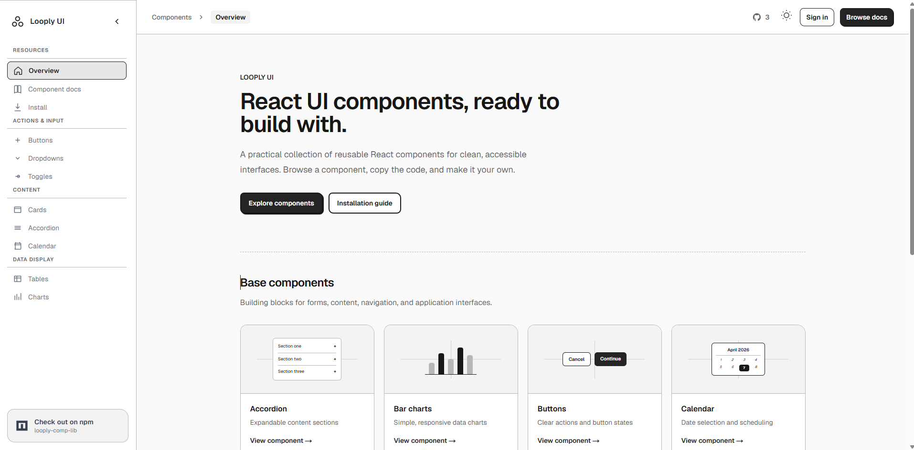

# Looply Component Library

Looply is a React component library and documentation site built with Next.js, TypeScript, and Tailwind CSS. It uses a monochrome, sketch-inspired visual system with clean surfaces, simple line work, and reusable `sketch-*` style variants.

[](https://www.npmjs.com/package/looply-comp-lib)
[](https://nextjs.org/)
[](component-library/infra)

[](https://github.com/Akin-Genc0/Component-Library/actions/workflows/linter.yml)



**Live site:** [loopl-y.com](https://loopl-y.com)
**Component docs:** [loopl-y.com/docs](https://loopl-y.com/docs)
**Install guide:** [loopl-y.com/examples](https://loopl-y.com/examples)

## Components

- `Accordion` - Expandable content sections
- `BarChart` - Responsive monochrome bar charts
- `Buttons` - Action buttons with optional icons
- `Calendar` - Interactive date selection
- `CalloutCard` - Announcement and CTA cards
- `Card` - Flexible content cards
- `Carousel` - Image and text carousel
- `Chat` - Customizable chat interface
- `Drawer` - Slide-over drawing panel
- `DropDown` - Menu dropdowns
- `Table` - Structured data tables
- `TextArea` - Multi-line form inputs
- `Toggle` - On/off controls

## Installation

```bash
npm install looply-comp-lib
```

Import the library stylesheet in your application layout:

```tsx
import "looply-comp-lib/styles.css";
```

For Tailwind CSS v4, include the package source in your global stylesheet:

```css
@import "tailwindcss";
@source "../node_modules/looply-comp-lib/dist";
```

## Usage

```tsx
import { Buttons, Card, Toggle } from "looply-comp-lib";
import "looply-comp-lib/styles.css";

export default function Example() {
  return (
    <div>
      <Buttons
        buttonObj={[
          { buttonText: "Cancel", buttonType: "sketch-flat" },
          { buttonText: "Continue", buttonType: "sketch-raised" },
        ]}
      />
      <Card
        cards={[
          {
            cardStyle: "sketch-flat",
            headerText: "Component card",
            subHeaderText: "A simple content surface",
            descriptionText: "Use cards to group related information and actions.",
          },
        ]}
      />
      <Toggle styleType="sketch-pressed" size="md" />
    </div>
  );
}
```

## Style Variants

The library uses `sketch-*` classes and prop values. Common surface variants are:

- `sketch-flat`
- `sketch-raised`
- `sketch-inset`
- `sketch-pressed`

Button-specific classes use the `sketch-btn-*` prefix. The older `neu-*` names are no longer part of the current API.

## Development

Run the site and package project from `component-library/`:

```bash
cd component-library
npm ci
npm run dev
```

Useful commands:

```bash
npm run lint
npm run build
npm run build:lib
```

## Tech Stack

- Next.js App Router
- React and TypeScript
- Tailwind CSS v4
- MDX component documentation
- Prisma and PostgreSQL
- next-themes
- Terraform and Google Cloud Run

## Branches

- `develop` - active development
- `qa` - quality assurance
- `prod` - production releases

## License

MIT
